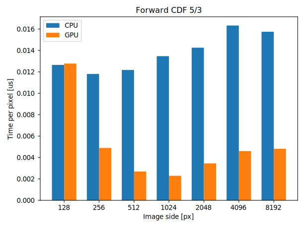
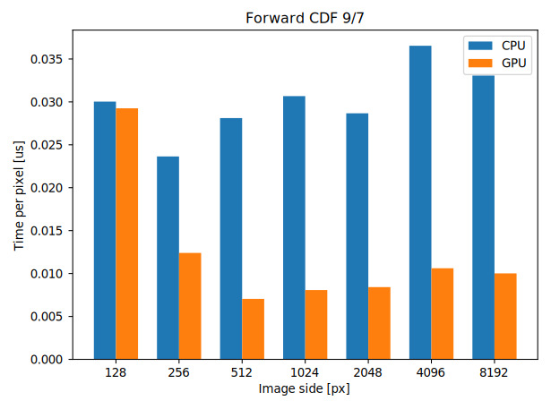
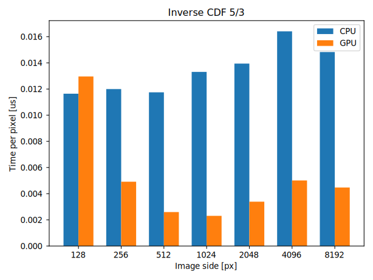
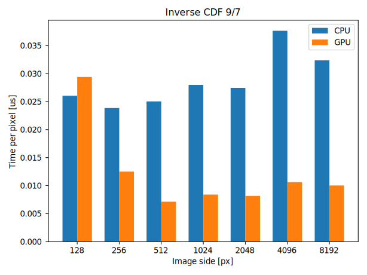

# 2D Discrete Wavelet Transformation on GPU using Lifting Scheme

- CDF 5/3 implemented using a parallel kernel from [Bařina 2015], i.e. using two kernels. The implementation uses integer arithmetics and is mathematically lossless.
- CDF 9/7 implemented using two sequentially applied parallel kernels of the same structure. The implementation used floating-point arithmetics and is generally lossy.
- Multi-level decomposition is performed by calling the same algorithm on the low-frequency component of the transform. 
- Texture memory is used to accelerate access to two-dimensional data.
- Both CPU and GPU implementation. The GPU implementation is built with OpenCL 2.2.

## Compilation

```
cmake -B build -DCMAKE_BUILD_TYPE=Release .
cmake --build build --config Release
```

## Usage

```
./dwt {forward|inverse} {cpu|gpu} {53|97} <input.ppm> <output.ppm>
```
Where:
- `53`, resp. `97` means performing the CDF 5/3 transformation, or resp. CDF 9/7.
- `<input.ppm>`, resp. `<output.ppm>` is the input, resp. output file in binary PPM format.

## Evaluation

The project was evaluated on a machine with the following parameters:

- Intel(R) Core(TM) i5-8300H CPU @ 2.30GHz GP107M
- GeForce GTX 1050 Mobile
- DDR4 8192 MB SODIMM @ 2.4 GHz

The measurement was performed on randomly generated square images of white noise with a side of $2^7$ pixels to $2^{13}$ pixels. For each category, the median was chosen from the measured data as a representative value. On the CPU, only the running of the algorithm itself was measured, on the GPU the time also includes data transfer to and from the GPU unit. The measured data is visualized in the following graphs:









It is clear from the graphs that the effectiveness of the implemented transformation acceleration increases with the size of the transformed image. This is true for both the CDF 9/7 and CDF 5/3 transforms. As the algorithm is symmetric, the inverse transformation, behaves the same as the forward transformation. The CDF 9/7 transformation is twice as slow as the CDF 5/3. This is due to twice the number of operations to transform one pixel.

## References

- D. Bařina. *Lifting Scheme Cores for Wavelet Transform.* PhD thesis, Brno University of Technology, Brno, 2015.